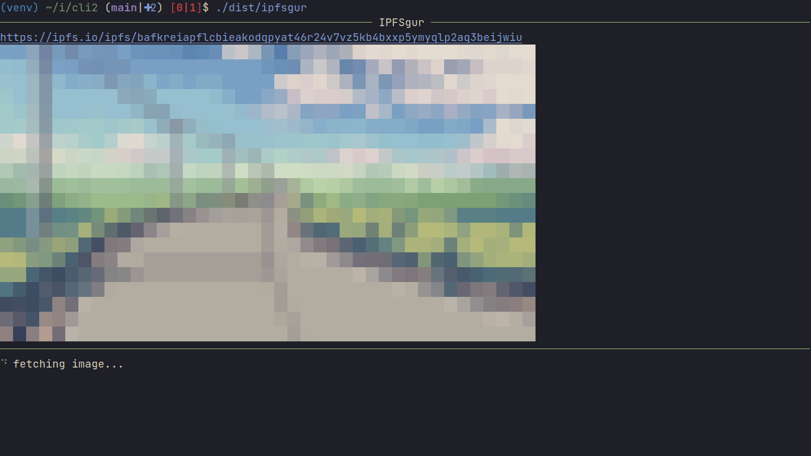

# IPFSgur - decentralized, censorship-resistant image hosting with IPFS using Filecoin



```
IPFSgur CLI

OPTIONS:
    help - display this help text
    put  - upload a single file. returns an IPFS gateway link to the file
    get  - download an image from IPFS. also shows its preview in the terminsl

Default behaviour:
    Homepage - a list of ten most recent images on IPFSgur, rendered in the terminal along with links
```
